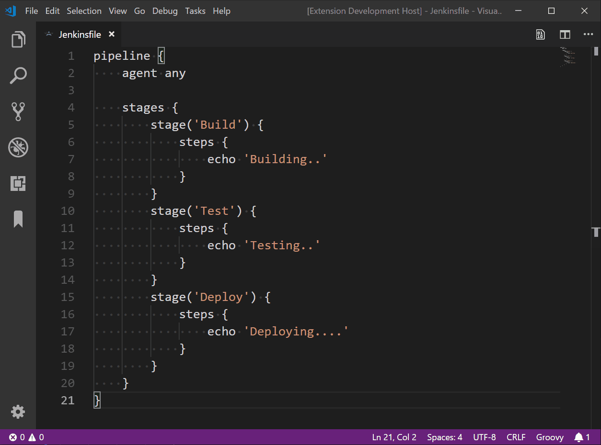
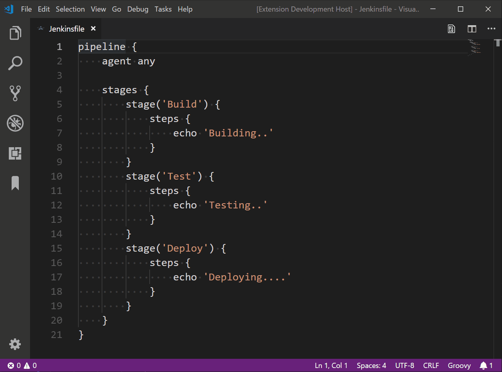

# jenkins-pipeline-linter-connector README

This extension validates Jenkinsfiles by sending them to the Pipeline Linter of a Jenkins server.

## Features

- Validate Jenkinsfiles from wihin vscode.

## Examples

## Extension Settings

This extension contributes the following settings:

* `jenkins.pipeline.linter.connector.url`: Url of the Jenkins Pipeline Linter.
* `jenkins.pipeline.linter.connector.crumbUrl`: Url of the Jenkins Crumb Issuer.
* `jenkins.pipeline.linter.connector.pass`: Jenkins username.
* `jenkins.pipeline.linter.connector.user`: Jenkins password.

## Release Notes

### 1.1.3

Added option to disable strict ssl validation.

### 1.1.2

Changed readme.

### 1.1.1

Changed dependency of url-parse for potential security problem.

### 1.1.0

Added the possibility to add the crumbUrl for Jenkins installations with active CRSF protection.

### 1.0.4

Changed output channel.

### 1.0.3

Bugfixes.

### 1.0.2

Bugfixes.

### 1.0.1

Bugfixes.

### 1.0.0

Initial release of jenkins-pipeline-linter-connector.
